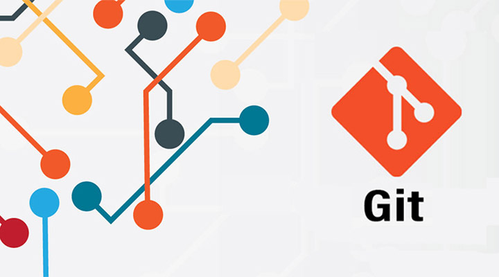

[> вернуться назад](./readme.md)

# ***Что такое GIT?***

__Git__  — система управления версиями с распределенной архитектурой. В отличие от некогда популярных систем вроде CVS и Subversion (SVN), где полная история версий проекта доступна лишь в одном месте, в Git каждая рабочая копия кода сама по себе является репозиторием. Это позволяет всем разработчикам хранить историю изменений в полном объеме.

*Разработка в Git ориентирована на обеспечение высокой производительности, безопасности и гибкости распределенной системы*

[Источник](https://www.atlassian.com/ru/git/tutorials/what-is-git "подробнее")

